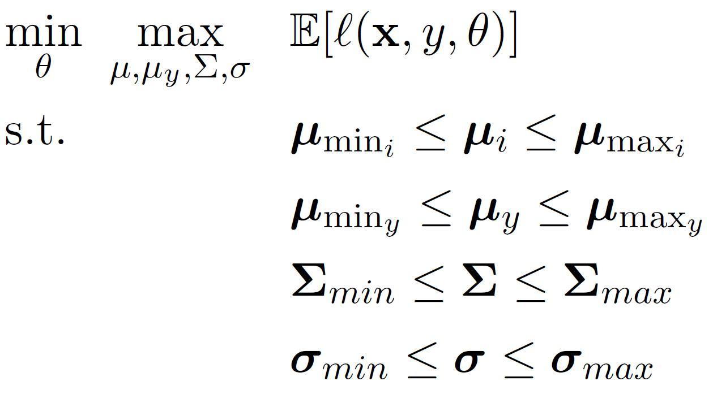

# Robust InFerence via Low-order moment Estimations (RIFLE)
RIFLE is a general framework for learning parameters of a statistical learning model on datasets containing a large amount of missing values. Supervised learning approaches, including linear regression, logistic regression, neural networks, and support vector machine (SVM) initially assume that the input data is complete, containing no missing values. However, availability of such clean datasets is scarce in many practical problems, especially in electronic medical records and clinical research. Integration of multiple datasets may also increase the size of data available to researchers as different organizations collect data from similar population in different areas. The obtained datasets can contain large blocks of missing values as they may not share exactly the same features (See below figure).


In practice, a pre-processing step is performed on a given dataset to remove or impute missing values. Removing the rows containing missing values is not an option when the percentage of missingness in a dataset is high, or the distribution of missing values is MNAR (Missing Not At Random). On the other hand, the state-of-the-art approaches for data
imputation are not robust to the large amount of missing values. Moreover, the error in the imputation phase can drastically affect the performance of the statistical model applied to the imputed dataset. 

An alternative approach for learning statistical models when the data is not complete is to learn the parameters of the model directly based on the available data. RIFLE is a distributionally robust optimization framework for the direct (without imputation) inference of a target variable based on a set of features containing missing values. The proposed framework does not require the data to be imputed as a pre-processing stage, although, it can be used as a pre-processing tool for imputing data as well. The main idea of RIFLE is to estimate appropriate confidence intervals for the first and second-order moments of the data by bootstrapping on the available data matrix entries and then finding the optimal parameters of the statistical model for the worst-case distribution with the low-order moments (mean and variance) within the estimated confidence intervals. 

Mathematically speaking, RIFLE solves the following min-max problem:

<div align='center'> 

</div>

## Robust Linear Regression Imputer
To run the robust linear regression imputer on a given dataset containing missing values, execute the following command on a terminal (linux) or command line (windows):

```
python run.py input_file.csv output_file.csv 
```
